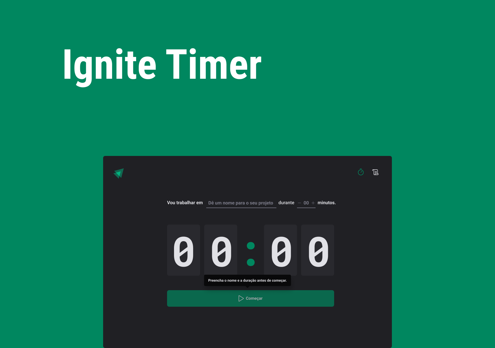

<h1 align="center">
   Ignite Timer

   

  
  
  
</h1>

 

Uma aplicação simples, no estilo pomodoro, para marcação de ciclos de tempos para serem dedicados a um projeto, tarefa ou semelhante.

### Techs

- [ ] ReactJS
- [ ] React Hook Form
- [ ] Styled Components
- [ ] Immer
- [ ] Zod
- [ ] Typescript
